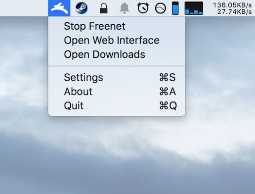
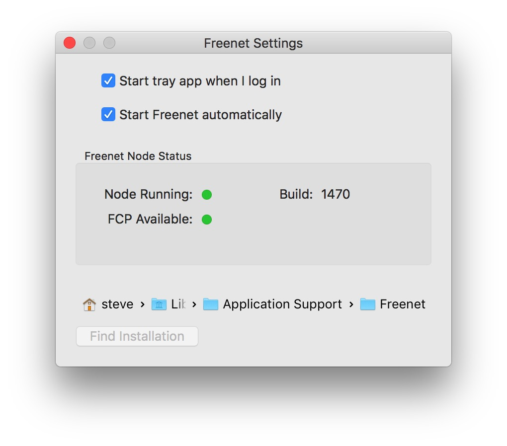

# FreenetTray

### About

This is a tray (menu bar) app for Freenet for OS X. 

#### Features

* Tray icon shows whether or not Freenet is running
* Dropdown menu for starting and stopping Freenet properly
* Easy access to the downloads folder

### Screenshots

##### Menu Bar



##### Settings



### Changelog

* 1.4
    * Automatically finds node installation, doesn't depend on installer anymore
    * Settings window with node status and location override
    * Menu option to open downloads folder
* 1.3.1.1
    * No code changes, this build exists to sync up the release numbers in git
* 1.3.1
    * Fixed start/stop functionality
    * Added initial FCP support
    * Added multiple vector tray icons drawn in code for Retina and beyond :)
    * Major internal refactoring
* ~1.3+
    * Version included with Freenet installations since ~2010
    * Various small changes made by contributors without a version bump
* 1.2
    * Probably never existed
* 1.1 
    * Added about panel to show copyright info
    * Updated code to include license file inside program bundle for distribution.
* 1.0
    * Initial release     
    * Start and stop the freenest node
    * Open the web interface
    * Quit the tray app 
    
### Licensing
 
See the Acknowledgements file for license and copyright information

### Build instructions

Before doing anything, ensure you have the following things on the build machine:

* A 64-bit Intel Mac running OS X 10.9+
* Xcode 6.x+ installed (must have the OS X 10.10 SDK)

DO NOT open FreenetTray.xcodeproj directly! The application requires CocoaPods, 
which will build the 3rd party library dependencies for you and generate an Xcode 
workspace for you to use.

##### Build steps

First, open a terminal and change directory to the source code location:

```sh
$ cd /path/to/java_installer/res/mac/FreenetTray/src
```

You will then need to install CocoaPods:

```sh
$ sudo gem install cocoapods
```

Now allow CocoaPods to download and build the required 3rd party libraries:

```sh
$ pod install
```

Cocoapods may take a few minutes, but quickly display build results like this:

```text
Analyzing dependencies

Downloading dependencies
Installing CocoaAsyncSocket <version number>
Installing IYLoginItem <version number>
Generating Pods project
Integrating client project
```

Now there should be a FreenetTray.xcworkspace file, open it:

```sh
$ open FreenetTray.xcworkspace 
```

Now you can build and run the application, or archive it for distribution.

When built against the OS X 10.10 SDK, the built application should be fully 
compatible with 64-bit Intel Macs running OS X 10.7 - OS X 10.10.

